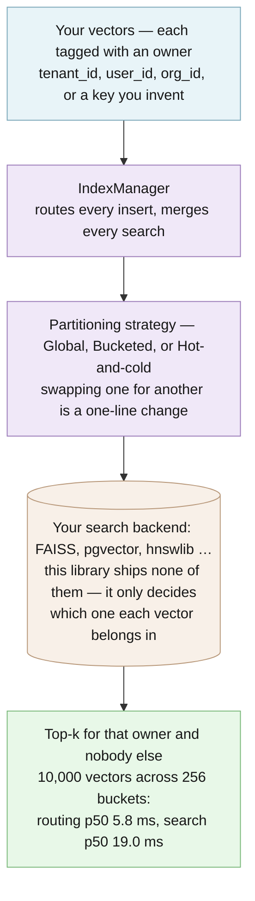

# edgeproc-core

Keeps each customer's search results apart in a shared vector index, and gives errors stable codes, for Python apps.

[](https://github.com/hseshadr/edgeproc-core/actions/workflows/dagger.yml)
[](CHANGELOG.md)
[](LICENSE)

[Docs](docs/README.md) · [Quickstart](docs/installation-guide.md)

```text
input:  "acme-invoice" and "globex-invoice", identical, stored in ONE shared index; search as acme
output: acme sees: [('acme-invoice', 0.0)]

input:  a raw failure shaped like an HTTP 402 response: {"status": 402}
output: {'type': 'ai.provider.out_of_credits', 'title': 'Your provider account is out of credits. Add credits and try again.', 'status': 402}
```
<sub>Real output of the example below, run against `edgeproc-core` 0.4.3 installed from PyPI.</sub>

## At a glance

- **What it does** — Two small tools for Python backends. First, like one drawer per customer in a shared filing cabinet: AI features that find "similar" items store each item as a list of numbers (an *embedding*) in a search index (a *vector index*); this library decides which part of a shared index each customer's items go in, and makes a search for one customer return only that customer's items. Second, like the error codes on a washing machine, for software failures: it turns an HTTP 402, a timeout or "Failed to fetch" into one stable name such as `ai.provider.out_of_credits`, with readable text and the standard web error format (RFC 9457 "Problem Details").
- **Who it's for** — A Python developer building a "more like this" or document-search feature that many customers share, who already has a search store (FAISS, pgvector, hnswlib, …) and must never show one customer another's results. Also anyone tired of rewriting the same error-handling `if` ladder in every layer of an app.
- **What stays on your device / what leaves it** — Nothing leaves: it is a library with no network calls and no telemetry, and its only dependency is pydantic. Your vectors live in whatever search store you plug in; this library only routes calls to it and merges the answers.
- **Runs on** — Python 3.13 or newer, on any operating system. You supply the search store; a small in-memory one is included for tests and examples.
- **Not for** — Searching by itself: it ships no production index. Nor is it a security boundary on its own: a partition name is a routing hint, so enforce access control in your store too.
- **Status** — Beta: v0.4.3 (pre-1.0), on [PyPI](https://pypi.org/project/edgeproc-core/). This source and packaged README describe v0.4.3. See [CHANGELOG](CHANGELOG.md).

## Try it in 60 seconds

Needs [uv](https://docs.astral.sh/uv/), which fetches Python 3.13 if you don't have it.

```bash
mkdir try-edgeproc-core && cd try-edgeproc-core && uv venv --python 3.13 && uv pip install edgeproc-core
```

Save this as `example.py` in that folder, then run `.venv/bin/python example.py`:

```python
import asyncio
from edgeproc_core import BucketedPartitionStrategy, IndexManager, VectorEmbedding
from edgeproc_core.errors import define_errors, starter_pack
from edgeproc_core.vector_mgmt.testing import in_memory_factory

async def main() -> None:
    # Worst case: two customers forced into ONE shared index (num_buckets=1).
    manager = IndexManager(BucketedPartitionStrategy(index_factory=in_memory_factory, num_buckets=1))
    for owner in ("acme", "globex"):
        await manager.insert([VectorEmbedding(entity_id=f"{owner}-invoice", embedding=[1.0, 0.0], metadata={"tenant_id": owner})])
    print("acme sees:", await manager.search([1.0, 0.0], k=10, partition_key="acme"))

asyncio.run(main())
errors = define_errors(starter_pack)  # 18 ready-made error codes
print(errors.to_problem_details(errors.classify({"status": 402})).to_dict())
```

It prints, verbatim. The two invoices are identical and share one index, yet acme sees only its own:

```text
acme sees: [('acme-invoice', 0.0)]
{'type': 'ai.provider.out_of_credits', 'title': 'Your provider account is out of credits. Add credits and try again.', 'status': 402}
```

More runnable examples: [`examples/`](examples/). Clone the repo and run `bash examples/run_loop.sh`
to walk every strategy and the error catalog against the bundled in-memory index.

<!-- ======================== BELOW THE FOLD ======================== -->

## How it works

You tag each vector with its owner (`tenant_id`, `user_id`, or a key you invent). `IndexManager`
asks the partitioning strategy which physical index that owner's vectors belong in (one global
index, one of N hash buckets, or a hot or cold tier) and calls your backend there. Every scoped
search, delete and stats call also passes the owner as a filter, so owners that share a physical
index still see only their own rows. Results from several indexes are merged into one top-k list.
The error catalog is a separate module: `classify` maps a raw failure to a code, `describe`
renders it, and `to_problem_details` serializes it.



**[Explore the interactive architecture map →](docs/architecture/index.html)**
(Archify, generated from [`docs/architecture/runtime.architecture.json`](docs/architecture/runtime.architecture.json)).
Deep dive: [docs/vector-mgmt-architecture.md](docs/vector-mgmt-architecture.md).

It is the bottom, most generic layer of a three-repo MIT-licensed stack: the partitioning
*protocol* (the set of methods a search backend must provide, as a Python `typing.Protocol`,
with nothing to subclass) and nothing more:

```
edge-reco        hybrid search + recommendations, running in the browser
  └─ edge-proc   ships big files to devices and proves they arrived unmodified
       └─ edgeproc-core   ← you are here: the vector-partitioning protocol
```

## What you can do

- Route vectors into one global index, hash buckets, or hot/cold tiers, and switch with one line — [partitioning strategies](#partitioning-strategies)
- Partition by any key, including composite keys — [generic partition keys](#generic-partition-keys)
- Prove your own backend applies partition filters before it serves more than one tenant — [conformance suite](#implementing-your-own-backend)
- Turn any raw failure into a stable code, readable text and RFC 9457 Problem Details — [canonical errors](#canonical-errors)
- Run every strategy end to end against an in-memory index — [`examples/`](examples/)

## Why this and not X

| Alternative | It is the better choice when | This library is the better choice when |
| --- | --- | --- |
| One index per customer | you have a few large customers and can afford an index each | you have thousands to millions of owners, where per-owner indexes waste memory and startup time |
| Your vector store's own namespaces or multi-tenancy | you are committed to that one store | you want the partitioning scheme to stay portable across FAISS, pgvector, hnswlib and tests |
| A hand-rolled "global index + metadata filter" | you only ever need that one scheme | you want to move to buckets or hot/cold tiers without rewriting callers, and a conformance suite that proves the filter is applied |
| Per-layer error `if` ladders | the app is tiny | the same failure must mean the same thing in the API, the UI and the logs (and in TypeScript, via `@edgeproc/errors`) |

## Security and trust model

- **Verified:** a scoped call is filtered by partition key inside the index, even when owners
  collide in one physical index. [`tests/test_tenant_isolation.py`](tests/test_tenant_isolation.py)
  forces `num_buckets=1` and checks it, and `assert_vector_index_conformance` checks the same
  property for *your* backend. Releases are built by Dagger from an exact `main` commit and
  published to PyPI by trusted publishing (OIDC) with attestations, from a job that first
  checks the candidate's lineage.
- **Refuses rather than warns:** the conformance suite raises `AssertionError` naming every
  property your backend breaks; `define_errors` raises on a duplicate code; Problem Details drop
  reserved members (`type`, `title`, `status`, `detail`, `instance`, `__proto__`, `constructor`,
  `prototype`, `toJSON`) and any value that is not a plain string or finite number; the PyPI
  publisher refuses a candidate that is not a successful dispatch of `release-candidate.yml`
  for a commit on `main`.
- **Not protected:** an *unscoped* call (no partition key) is a deliberate cross-partition
  administrative read or delete; partition names are routing hints, never security
  principals; a backend that ignores `filters` leaks across owners (run the conformance suite);
  `InMemoryVectorIndex` is not a production store; Problem Details members are public, so never
  pass secrets as params.
- **Verify a release:** the wheel and sdist on PyPI carry PEP 740 attestations. Check one with
  `pypi-attestations verify pypi --repository https://github.com/hseshadr/edgeproc-core pypi:edgeproc_core-0.4.3-py3-none-any.whl`,
  or read `https://pypi.org/integrity/edgeproc-core/0.4.3/edgeproc_core-0.4.3-py3-none-any.whl/provenance`.

See [SECURITY.md](SECURITY.md) for reporting a vulnerability, and
[docs/OPERATIONS.md](docs/OPERATIONS.md) for the security, privacy, reliability, and
measured-performance ownership contract.

## What this proves / what it does not prove

The hosted CI run and full local gate pass at **99.31% coverage measured with branches enabled**,
with strict mypy, lint, and formatting. The gate runs `--cov-branch` and
enforces a ≥90% branch coverage floor. Split into its two parts: 99.13% of statements
and 100.00% of branches are covered. A gate step re-derives all three figures from
`coverage.xml` so this paragraph cannot quietly drift.

The bundled benchmark (`benchmarks/benchmark.py`) reports
**routing p50 5.8 ms / p95 6.0 ms** for 10,000 embeddings across 256 buckets,
and **reference search p50 19.0 ms / p95 19.2 ms** against the bundled
in-memory index — see [`InMemoryVectorIndex`](#a-minimal-search) below for
what that reference index is (and isn't).

Measured 2026-07-20 on an Apple M3 Pro (macOS 26.5, arm64, CPython 3.13.5),
20 samples per run, machine otherwise idle. Across six consecutive runs routing
p50 spanned 5.7–6.1 ms and search p95 spanned 18.7–20.2 ms; a busy machine
measures materially higher. These describe that tree on that laptop, not a
promise for your hardware — reproduce with:

```bash
uv run python benchmarks/benchmark.py
```

It does **not** prove the recall or latency of any real backend (the numbers above come from
the bundled in-memory reference index), that your backend isolates owners (run the conformance
suite against it), or anything about `rebuild()` or tombstone attribution in your store.

## Install

Requires **Python 3.13 or newer**.

Install from [PyPI](https://pypi.org/project/edgeproc-core/):

```bash
uv pip install edgeproc-core
```

In your `pyproject.toml`:
```toml
dependencies = ["edgeproc-core==0.4.3"]
```

Verify it worked:
```bash
python -c "import edgeproc_core; print(edgeproc_core.__version__)"
# 0.4.3
```

Prefer to build from source? Pin a full commit SHA — Git cannot repoint it, so
it is exactly as immutable as a release:

```bash
uv pip install "edgeproc-core @ git+https://github.com/hseshadr/edgeproc-core.git@7b3ab4de97441ae4be64c082ae432d914d65c240"
```

> **Why do source pins use a commit and not a tag?** Tags `v0.2.0` and older
> were cut before the import package was renamed to `edgeproc_core`, so they
> ship the old `shared_libs_python` module and every example here would raise
> `ModuleNotFoundError`. Pin a commit at or after the rename (like the one
> above), or install from PyPI as shown first. `0.4.3` contains the strengthened
> source-install contract. `0.2.1` and `0.2.2` carry a cross-tenant
> delete defect fixed in `0.3.0`, and `0.3.0` ships without the `conformance`
> module its README documents.

For local development:
```bash
git clone https://github.com/hseshadr/edgeproc-core.git
cd edgeproc-core
uv sync
```

## Usage & API

### A minimal search

A teaser against the bundled in-memory reference index — produces real output.

```python
import asyncio
from edgeproc_core import GlobalPartitionStrategy, IndexManager, VectorEmbedding
from edgeproc_core.vector_mgmt.testing import in_memory_factory

async def demo() -> None:
    strategy = GlobalPartitionStrategy(index_factory=in_memory_factory)
    manager = IndexManager(partition_strategy=strategy)
    await manager.insert(
        [VectorEmbedding(entity_id="a", embedding=[0.1, 0.2, 0.3, 0.4], tenant_id="t1")],
        partition_key="t1",
    )
    print(await manager.search([0.1, 0.2, 0.3, 0.4], k=5, partition_key="t1"))

asyncio.run(demo())  # → [('a', ~0.0)]  exact match, cosine distance ≈ 0
```

`InMemoryVectorIndex` is a reference implementation for tests and examples; in
production you implement `VectorIndex` against your own backend. See
[`edge-proc`'s `LocalVecIndex`](https://github.com/hseshadr/edge-proc) for a
FAISS-backed example, and [Implementing your own backend](#implementing-your-own-backend)
for the conformance suite that proves yours is correct.

### Implementing your own backend

If you implement `VectorIndex` yourself, **run the conformance suite against it.**
One command tells you whether your backend is safe to put in front of more than one
tenant:

```python
# tests/test_my_backend_conformance.py
from edgeproc_core.vector_mgmt.conformance import assert_vector_index_conformance

from my_project import MyVectorIndex


async def my_factory(name, config=None):
    return MyVectorIndex(name, config)


async def test_my_backend_is_conformant():
    await assert_vector_index_conformance(my_factory)
```

It passes silently and raises `AssertionError` naming every property you break.
Not using pytest? It is a plain coroutine — `asyncio.run(assert_vector_index_conformance(my_factory))`
exits non-zero on failure.

If your partition key is not `tenant_id`, say so:
`assert_vector_index_conformance(my_factory, partition_key_name="org_id")`.

**Why you need this.** `delete()` and `get_stats()` take a `filters` argument, and
`IndexManager` passes the partition scope through it. The argument has a default, so
a backend that accepts `filters` and never applies it still type-checks, still passes
its own tests — and silently deletes the *neighbouring* tenant's rows on every scoped
delete. Bucket collisions are expected by design, so the index a key routes to
routinely holds other keys' rows; nothing in a compiler or a linter can see that
failure. The suite seeds two partitions into one physical index, gives every row the
same vector so ranking cannot be what separates them, and checks that the filter is
actually applied:

| Check | What it catches |
| --- | --- |
| `rows_are_readable_back` | Nothing was stored, so every result below would be vacuous |
| `search_applies_filters` | A scoped read returns someone else's rows |
| `search_ands_multi_key_filters` | Filter keys ORed, so a partition key narrows nothing |
| `empty_filters_search_is_unscoped` | `filters={}` read as a scope, so an admin read sees nothing |
| `scoped_delete_spares_other_partitions` | **Cross-partition data destruction** |
| `scoped_delete_removes_its_own_rows` | A backend "passing" by never deleting |
| `multi_key_delete_ands_its_filters` | **Cross-partition destruction via ORed filter keys** |
| `unscoped_delete_is_administrative` | An unscoped delete silently doing nothing |
| `empty_filters_delete_is_administrative` | `filters={}` silently deleting nothing and reporting success |
| `unscoped_stats_report_the_physical_total` | Stats that never saw the rows |
| `empty_filters_stats_report_the_physical_total` | `filters={}` counted as an empty scope |
| `scoped_stats_count_only_their_partition` | A row count leaked across partitions |
| `multi_key_stats_count_the_intersection` | A count inflated by a neighbour's rows |

**Two things the checks depend on, and why.** Filter keys are **ANDed** — a row must
match every one of them. `IndexManager` merges the partition scope *into* your
filters, so a backend that ORs them lets the partition key stop narrowing anything:
a tenant-scoped search carrying any filter of its own returns every other tenant's
matching rows, and the matching delete destroys them. And an **empty filter mapping
is no scope at all**, identical to passing none. That is not a corner case: the
manager composes `{}` — never `None` — for every unscoped call, so it is the only
shape an administrative delete ever reaches your backend in.

What it does **not** grade: recall, latency, `rebuild()`, and how you attribute
tombstones to a scope. Those are backend-specific and untested here.

### Partitioning strategies

All strategies accept `partition_key_name` (default `"tenant_id"`) and an
optional `partition_key_extractor` callable.

| Strategy | When to use | How it routes |
|----------|-------------|---------------|
| `GlobalPartitionStrategy` | < 50K partition keys | One global index; filter by metadata at query time — [example](examples/basic_usage.py) |
| `BucketedPartitionStrategy` | 50K – 5M partition keys | Hash the partition key into one of N buckets (default 256) — [example](examples/custom_partition_key.py) |
| `TwoTierPartitionStrategy` | Time-keyed workloads | Split by `metadata["created_at"]` into a hot tier and a cold tier — [example](examples/two_tier_partition.py) |

Bucketing means collisions are expected by design: once partition keys outnumber
buckets, two tenants share one physical index. Isolation does not depend on them
landing in different buckets — a scoped call filters by partition key inside the
index. [`tests/test_tenant_isolation.py`](tests/test_tenant_isolation.py) proves
this by forcing the worst case (`num_buckets=1`, every key colliding) and
asserting a tenant still sees only its own rows. Partition names are routing
hints, never security principals: enforce isolation in your backing store too.

`search`, `delete` and `get_stats` all mean the same thing by `partition_key`:
each one filters, so a caller cannot destroy or count a row it could not read.
Pass no key and there is no filter — that is the documented administrative,
cross-partition path. `rebuild_if_needed` is the one deliberate exception: a
slice of a shared index cannot be compacted on its own, so there `partition_key`
picks which physical index to maintain and nothing more.

The deep dive (rationale, scaling math, recommended `m` / `ef_construction`)
lives in [`docs/vector-mgmt-architecture.md`](docs/vector-mgmt-architecture.md).
The security, privacy, reliability, and measured-performance ownership contract
lives in [`docs/OPERATIONS.md`](docs/OPERATIONS.md).

### Generic partition keys

The library was originally `tenant_id`-only. v0.1+ supports any partition key:

- store it in `VectorEmbedding.metadata` (e.g. `{"user_id": "u1"}`),
- pass `partition_key_name="user_id"` to your strategy and manager,
- optionally pass a `partition_key_extractor` for composite keys (see
  [`examples/composite_partition_key.py`](examples/composite_partition_key.py)).

The legacy `tenant_id` field on `VectorEmbedding` still works.

### Canonical errors

The package ships a second, independent module: `edgeproc_core.errors`.
It has nothing to do with vector search — it solves a different recurring
problem, and it is roughly as much code as the partitioning layer.

**The problem.** The same failure arrives in a dozen shapes. An HTTP 402, a
thrown `TimeoutError`, a browser's "Failed to fetch" — each is a different
object, so every layer of an app re-writes the same brittle `if` ladder to
decide what to show the user, and the answers drift apart.

**What it does.** You register a *catalog* — a set of stable, namespaced codes
like `net.unreachable` — and then always speak in codes:

- `classify(raw)` turns any raw failure into a stable code
- `describe(code)` renders human text, through your own i18n if you have one
- `to_problem_details(code).to_dict()` produces the [RFC 9457](https://www.rfc-editor.org/rfc/rfc9457)
  Problem Details JSON an API returns. Params become public extension members, so never
  pass secrets. Only params with a plain `str` key and a `str`, `int`, or finite `float`
  value reach the body; params named `type`, `title`, `status`, `detail`, `instance`,
  `__proto__`, `constructor`, `prototype`, or `toJSON` are reserved and dropped

```python
from edgeproc_core.errors import define_errors, starter_pack

registry = define_errors(starter_pack)          # 18 universal codes, or bring your own
registry.classify({"status": 402})              # → 'ai.provider.out_of_credits'
registry.describe("net.unreachable")            # → "Couldn't reach the server. …"
registry.to_problem_details("net.unreachable").to_dict()
```

`starter_pack` covers the common provider / config / network / timeout / device
/ integrity / internal cases so you need not re-declare them; `define_errors`
rejects a duplicate code at registration. The codes match the TypeScript
`@edgeproc/errors` package, so a failure keeps one identity across a stack.

Runnable demo: [`examples/canonical_errors.py`](examples/canonical_errors.py).

### Source tree

```
edgeproc_core/
  vector_mgmt/
    core/
      types.py          # VectorEmbedding, IndexConfig, IndexStats, VectorIndex, IndexFactory
      index_manager.py  # IndexManager — routes inserts, merges top-k searches
    partitioning/
      strategies.py     # GlobalPartitionStrategy, BucketedPartitionStrategy, TwoTierPartitionStrategy
    testing.py          # InMemoryVectorIndex — reference impl for tests + examples
    conformance.py      # assert_vector_index_conformance — grade your own backend
  errors/               # canonical error codes (see "Canonical errors" below)
    types.py            # Category, CatalogEntry, ProblemDetails (RFC 9457)
    registry.py         # Registry + define_errors — classify / describe / serialize
    starter_pack.py     # 18 universal codes, ready to reuse
    raw.py              # duck-typing helpers for failures of unknown shape
    canonical_error.py  # CanonicalError, DuplicateCodeError
examples/               # basic / custom-key / composite-key / two-tier / errors, plus run_loop.sh
tests/                  # pytest suite (≥90% branch coverage enforced by the gate)
```

### Design notes

- **Two Protocols decouple everything.** The partitioning strategy is separated
  from the index backend behind `VectorIndex` and `IndexFactory`. Swap the
  strategy (`Global` / `Bucketed` / `TwoTier`) without touching the index; swap
  the index without touching the strategy.
- **Why it exists.** Every multi-tenant vector-search system rediscovers the
  same partitioning patterns ("global + filter", "hash buckets", "hot/cold").
  This library does that once, cleanly typed, so downstream projects
  (`edge-proc`, …) can `import edgeproc_core` instead of reinventing it.
- **Quality bar.** `mypy --strict` clean, xenon Grade A complexity, ≥90% branch
  coverage. Backwards-compatible with the legacy `tenant_id` API.

[`edge-proc`](https://github.com/hseshadr/edge-proc) implements this library's
`VectorIndex` protocol over FAISS, and [`edge-reco`](https://github.com/hseshadr/edge-reco)
([live demo](https://edge-reco.com)) is built on `edge-proc`. A clean partitioning
protocol is what lets the vector index ship as a content-addressed, CDN-distributable,
locally-runnable artifact — the foundation of zero-per-query-cost, offline-capable
search.

## Configuration

There are no environment variables or config files. Every knob is a constructor argument:

| Knob | Where | Default | What it changes |
| --- | --- | --- | --- |
| `partition_key_name` | every strategy, `IndexManager` | `"tenant_id"` | which metadata key names the owner |
| `partition_key_extractor` | every strategy | `None` | a callable for composite keys |
| `num_buckets` | `BucketedPartitionStrategy` | `256` | how many physical indexes owners are hashed into |
| `hot_retention_days` | `TwoTierPartitionStrategy` | `30` | how old (by `metadata["created_at"]`) a vector gets before it moves to the cold tier |
| `index_factory` | every strategy | — (required) | builds your backend's index for a partition name |
| `m`, `ef_construction`, `ef_search`, `dimension`, `distance_metric` | `IndexConfig` | `32`, `200`, `100`, `1536`, `"cosine"` | passed through to your backend; this library builds no HNSW graph |
| rebuild thresholds | `IndexManager.rebuild_if_needed` | tombstones > 10% or size > 1000 MB | when a physical index is rebuilt |

## Limitations & roadmap

**Shipped (v0.4.3):** the three partitioning strategies, generic and composite partition
keys, `IndexManager`, the in-memory reference index, the backend conformance suite, and the
canonical error catalog with RFC 9457 Problem Details.

**Planned (not shipped):** some sections of
[docs/vector-mgmt-architecture.md](docs/vector-mgmt-architecture.md) describe planned
features (for example atomic-swap reindexing and query-optimization patterns); they are design
notes, not shipped code. No production backend ships in this package.

## Getting help

- **GitHub Issues** — Best for: bugs and concrete feature requests.
- **Private security advisory** — Best for: security reports; see [SECURITY.md](SECURITY.md).

## Contributing / development

```bash
uv sync
uv run poe gate         # THE gate: lint + format check + mypy --strict + xenon A + tests ≥90% cov
uv run poe lint
uv run poe fmt          # auto-format
uv run poe fmt-check    # format check only (part of the gate)
uv run poe typecheck    # mypy --strict
uv run poe complexity   # xenon Grade A (cyclomatic ≤ 5)
uv run poe test
```

`uv run poe gate` mirrors CI exactly, both directions — if it passes locally,
CI passes. The whole public surface — not just edited code — must clear it
before a release tag is cut.

See [CONTRIBUTING.md](CONTRIBUTING.md).

## License / Citation

MIT — see [LICENSE](LICENSE).
