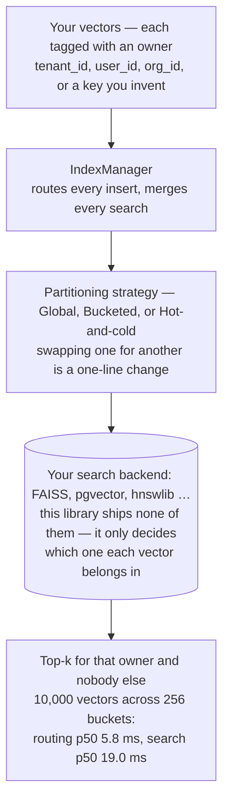

# edgeproc-core

[](https://github.com/hseshadr/edgeproc-core/actions/workflows/ci.yml)
[](https://codecov.io/gh/hseshadr/edgeproc-core)
[](https://www.python.org/downloads/)
[](https://opensource.org/licenses/MIT)

AI models turn text, images, and products into **embeddings** — long lists of
numbers where similar things get similar numbers. Finding the embeddings closest
to a query is called **vector search**, and it is how "more like this" features
work.

This library answers one specific, deceptively hard question about vector
search: when your data belongs to many different owners — users, tenants, time
periods — **how do you split it up so search stays fast and nobody ever sees
anyone else's results?** You bring the search index (FAISS, pgvector, hnswlib,
…); this library routes every vector into the right partition and merges
search results back out. Swapping partitioning schemes is a one-line change,
and the index backend never has to know.

Two things that promise does **not** mean. It holds for a *scoped* call — one
you pass a partition key to. Pass no key and there is no filter: that is a
deliberate cross-partition administrative read. And partition names are routing
hints, never security principals — enforce isolation in your backing store too.
The full contract is under [Partitioning strategies](#partitioning-strategies).

It is the bottom, most generic layer of a three-repo MIT-licensed stack — the
partitioning *protocol* (a *protocol* here is just the set of methods a search
backend must provide — Python's `typing.Protocol`, nothing to subclass),
nothing more:

```
edge-reco        hybrid search + recommendations, running in the browser
  └─ edge-proc   ships big files to devices and proves they arrived unmodified
       └─ edgeproc-core   ← you are here: the vector-partitioning protocol
```

Everything the library does, end to end:



**Status:** v0.4.1, alpha. Small and focused by design — the foundation, not
the headline. The hosted CI run and the full local gate pass at **99.28%
coverage measured with branches enabled**, with strict mypy, lint, and
formatting. The gate runs `--cov-branch` and enforces a ≥90% branch coverage
floor, so that is a measurement and not an assertion. Split into its two parts:
99.10% of statements and 100.00% of branches are covered. A gate step re-derives
all three figures from `coverage.xml` on every run, so this paragraph cannot
quietly drift away from what the suite actually measures.

As of `v0.2.1` the package is published on
[PyPI](https://pypi.org/project/edgeproc-core/), so `pip install edgeproc-core`
is the supported install. See [Installation](#installation).

The bundled benchmark (`benchmarks/benchmark.py`) reports
**routing p50 5.8 ms / p95 6.0 ms** for 10,000 embeddings across 256 buckets,
and **reference search p50 19.0 ms / p95 19.2 ms** against the bundled
in-memory index — see [`InMemoryVectorIndex`](#60-second-quickstart) below for
what that reference index is (and isn't).

Measured 2026-07-20 on an Apple M3 Pro (macOS 26.5, arm64, CPython 3.13.5),
20 samples per run, machine otherwise idle. Across six consecutive runs routing
p50 spanned 5.7–6.1 ms and search p95 spanned 18.7–20.2 ms; a busy machine
measures materially higher. These describe that tree on that laptop, not a
promise for your hardware — reproduce with:

```bash
uv run python benchmarks/benchmark.py
```

```bash
uv sync
uv run poe gate
```

This repository is a protocol and reference implementation, not a hosted search
service. The caller owns backend isolation, resource ceilings, and production SLOs;
`edge-proc` supplies the local runtime that consumes these contracts.

## 60-second quickstart

A teaser against the bundled in-memory reference index — produces real output.

```python
import asyncio
from edgeproc_core import GlobalPartitionStrategy, IndexManager, VectorEmbedding
from edgeproc_core.vector_mgmt.testing import in_memory_factory

async def demo() -> None:
    strategy = GlobalPartitionStrategy(index_factory=in_memory_factory)
    manager = IndexManager(partition_strategy=strategy)
    await manager.insert(
        [VectorEmbedding(entity_id="a", embedding=[0.1, 0.2, 0.3, 0.4], tenant_id="t1")],
        partition_key="t1",
    )
    print(await manager.search([0.1, 0.2, 0.3, 0.4], k=5, partition_key="t1"))

asyncio.run(demo())  # → [('a', ~0.0)]  exact match, cosine distance ≈ 0
```

Or run all five bundled examples end-to-end:

```bash
git clone https://github.com/hseshadr/edgeproc-core.git
cd edgeproc-core
uv sync
bash examples/run_loop.sh
```

`InMemoryVectorIndex` is a reference implementation for tests and examples; in
production you implement `VectorIndex` against your own backend. See
[`edge-proc`'s `LocalVecIndex`](https://github.com/hseshadr/edge-proc) for a
FAISS-backed example, and [Implementing your own backend](#implementing-your-own-backend)
for the conformance suite that proves yours is correct.

## Implementing your own backend

If you implement `VectorIndex` yourself, **run the conformance suite against it.**
One command tells you whether your backend is safe to put in front of more than one
tenant:

```python
# tests/test_my_backend_conformance.py
from edgeproc_core.vector_mgmt.conformance import assert_vector_index_conformance

from my_project import MyVectorIndex


async def my_factory(name, config=None):
    return MyVectorIndex(name, config)


async def test_my_backend_is_conformant():
    await assert_vector_index_conformance(my_factory)
```

It passes silently and raises `AssertionError` naming every property you break.
Not using pytest? It is a plain coroutine — `asyncio.run(assert_vector_index_conformance(my_factory))`
exits non-zero on failure.

If your partition key is not `tenant_id`, say so:
`assert_vector_index_conformance(my_factory, partition_key_name="org_id")`.

**Why you need this.** `delete()` and `get_stats()` take a `filters` argument, and
`IndexManager` passes the partition scope through it. The argument has a default, so
a backend that accepts `filters` and never applies it still type-checks, still passes
its own tests — and silently deletes the *neighbouring* tenant's rows on every scoped
delete. Bucket collisions are expected by design, so the index a key routes to
routinely holds other keys' rows; nothing in a compiler or a linter can see that
failure. The suite seeds two partitions into one physical index, gives every row the
same vector so ranking cannot be what separates them, and checks that the filter is
actually applied:

| Check | What it catches |
| --- | --- |
| `rows_are_readable_back` | Nothing was stored, so every result below would be vacuous |
| `search_applies_filters` | A scoped read returns someone else's rows |
| `search_ands_multi_key_filters` | Filter keys ORed, so a partition key narrows nothing |
| `empty_filters_search_is_unscoped` | `filters={}` read as a scope, so an admin read sees nothing |
| `scoped_delete_spares_other_partitions` | **Cross-partition data destruction** |
| `scoped_delete_removes_its_own_rows` | A backend "passing" by never deleting |
| `multi_key_delete_ands_its_filters` | **Cross-partition destruction via ORed filter keys** |
| `unscoped_delete_is_administrative` | An unscoped delete silently doing nothing |
| `empty_filters_delete_is_administrative` | `filters={}` silently deleting nothing and reporting success |
| `unscoped_stats_report_the_physical_total` | Stats that never saw the rows |
| `empty_filters_stats_report_the_physical_total` | `filters={}` counted as an empty scope |
| `scoped_stats_count_only_their_partition` | A row count leaked across partitions |
| `multi_key_stats_count_the_intersection` | A count inflated by a neighbour's rows |

**Two things the checks depend on, and why.** Filter keys are **ANDed** — a row must
match every one of them. `IndexManager` merges the partition scope *into* your
filters, so a backend that ORs them lets the partition key stop narrowing anything:
a tenant-scoped search carrying any filter of its own returns every other tenant's
matching rows, and the matching delete destroys them. And an **empty filter mapping
is no scope at all**, identical to passing none. That is not a corner case: the
manager composes `{}` — never `None` — for every unscoped call, so it is the only
shape an administrative delete ever reaches your backend in.

What it does **not** grade: recall, latency, `rebuild()`, and how you attribute
tombstones to a scope. Those are backend-specific and untested here.

## Installation

Requires **Python 3.13 or newer**.

Install from [PyPI](https://pypi.org/project/edgeproc-core/):

```bash
uv pip install edgeproc-core
```

In your `pyproject.toml`:
```toml
dependencies = [
  "edgeproc-core>=0.4.1",
]
```

Verify it worked:
```bash
python -c "import edgeproc_core; print(edgeproc_core.__version__)"
# 0.4.1
```

Prefer to build from source? Pin a full commit SHA — Git cannot repoint it, so
it is exactly as immutable as a release:

```bash
uv pip install "edgeproc-core @ git+https://github.com/hseshadr/edgeproc-core.git@6cdf8475b223262821622a021c561aed9213a472"
```

> **Why do source pins use a commit and not a tag?** Tags `v0.2.0` and older
> were cut before the import package was renamed to `edgeproc_core`, so they
> ship the old `shared_libs_python` module and every example here would raise
> `ModuleNotFoundError`. Pin a commit at or after the rename (like the one
> above), or install from PyPI as shown first. Use `0.4.1` or newer: `0.2.1`
> and `0.2.2` carry a cross-tenant delete defect fixed in `0.3.0`, and `0.3.0`
> ships without the `conformance` module its README documents.

For local development:
```bash
git clone https://github.com/hseshadr/edgeproc-core.git
cd edgeproc-core
uv sync
```

## Under the hood (for developers)

- **Two Protocols decouple everything.** The partitioning strategy is separated
  from the index backend behind `VectorIndex` and `IndexFactory`. Swap the
  strategy (`Global` / `Bucketed` / `TwoTier`) without touching the index; swap
  the index without touching the strategy.
- **Why it exists.** Every multi-tenant vector-search system rediscovers the
  same partitioning patterns ("global + filter", "hash buckets", "hot/cold").
  This library does that once, cleanly typed, so downstream projects
  (`edge-proc`, …) can `import edgeproc_core` instead of reinventing it.
- **Quality bar.** `mypy --strict` clean, xenon Grade A complexity, ≥90% branch
  coverage. Backwards-compatible with the legacy `tenant_id` API.

[`edge-proc`](https://github.com/hseshadr/edge-proc) implements this library's
`VectorIndex` protocol over FAISS, and [`edge-reco`](https://github.com/hseshadr/edge-reco)
([live demo](https://edge-reco.com)) is built on `edge-proc`. A clean partitioning
protocol is what lets the vector index ship as a content-addressed, CDN-distributable,
locally-runnable artifact — the foundation of zero-per-query-cost, offline-capable
search.

### Source tree

```
edgeproc_core/
  vector_mgmt/
    core/
      types.py          # VectorEmbedding, IndexConfig, IndexStats, VectorIndex, IndexFactory
      index_manager.py  # IndexManager — routes inserts, merges top-k searches
    partitioning/
      strategies.py     # GlobalPartitionStrategy, BucketedPartitionStrategy, TwoTierPartitionStrategy
    testing.py          # InMemoryVectorIndex — reference impl for tests + examples
    conformance.py      # assert_vector_index_conformance — grade your own backend
  errors/               # canonical error codes (see "Canonical errors" below)
    types.py            # Category, CatalogEntry, ProblemDetails (RFC 9457)
    registry.py         # Registry + define_errors — classify / describe / serialize
    starter_pack.py     # 18 universal codes, ready to reuse
    raw.py              # duck-typing helpers for failures of unknown shape
    canonical_error.py  # CanonicalError, DuplicateCodeError
examples/               # basic / custom-key / composite-key / two-tier / errors, plus run_loop.sh
tests/                  # pytest suite (≥90% branch coverage enforced by the gate)
```

### Partitioning strategies

All strategies accept `partition_key_name` (default `"tenant_id"`) and an
optional `partition_key_extractor` callable.

| Strategy | When to use | How it routes |
|----------|-------------|---------------|
| `GlobalPartitionStrategy` | < 50K partition keys | One global index; filter by metadata at query time — [example](examples/basic_usage.py) |
| `BucketedPartitionStrategy` | 50K – 5M partition keys | Hash the partition key into one of N buckets (default 256) — [example](examples/custom_partition_key.py) |
| `TwoTierPartitionStrategy` | Time-keyed workloads | Split by `metadata["created_at"]` into a hot tier and a cold tier — [example](examples/two_tier_partition.py) |

Bucketing means collisions are expected by design: once partition keys outnumber
buckets, two tenants share one physical index. Isolation does not depend on them
landing in different buckets — a scoped call filters by partition key inside the
index. [`tests/test_tenant_isolation.py`](tests/test_tenant_isolation.py) proves
this by forcing the worst case (`num_buckets=1`, every key colliding) and
asserting a tenant still sees only its own rows. Partition names are routing
hints, never security principals: enforce isolation in your backing store too.

`search`, `delete` and `get_stats` all mean the same thing by `partition_key`:
each one filters, so a caller cannot destroy or count a row it could not read.
Pass no key and there is no filter — that is the documented administrative,
cross-partition path. `rebuild_if_needed` is the one deliberate exception: a
slice of a shared index cannot be compacted on its own, so there `partition_key`
picks which physical index to maintain and nothing more.

The deep dive (rationale, scaling math, recommended `m` / `ef_construction`)
lives in [`docs/vector-mgmt-architecture.md`](docs/vector-mgmt-architecture.md).
The security, privacy, reliability, and measured-performance ownership contract
lives in [`docs/OPERATIONS.md`](docs/OPERATIONS.md).

### Canonical errors

The package ships a second, independent module: `edgeproc_core.errors`.
It has nothing to do with vector search — it solves a different recurring
problem, and it is roughly as much code as the partitioning layer.

**The problem.** The same failure arrives in a dozen shapes. An HTTP 402, a
thrown `TimeoutError`, a browser's "Failed to fetch" — each is a different
object, so every layer of an app re-writes the same brittle `if` ladder to
decide what to show the user, and the answers drift apart.

**What it does.** You register a *catalog* — a set of stable, namespaced codes
like `net.unreachable` — and then always speak in codes:

- `classify(raw)` turns any raw failure into a stable code
- `describe(code)` renders human text, through your own i18n if you have one
- `to_problem_details(code).to_dict()` produces the [RFC 9457](https://www.rfc-editor.org/rfc/rfc9457)
  Problem Details JSON an API returns

```python
from edgeproc_core.errors import define_errors, starter_pack

registry = define_errors(starter_pack)          # 18 universal codes, or bring your own
registry.classify({"status": 402})              # → 'ai.provider.out_of_credits'
registry.describe("net.unreachable")            # → "Couldn't reach the server. …"
registry.to_problem_details("net.unreachable").to_dict()
```

`starter_pack` covers the common provider / config / network / timeout / device
/ integrity / internal cases so you need not re-declare them; `define_errors`
rejects a duplicate code at registration. The codes match the TypeScript
`@edgeproc/errors` package, so a failure keeps one identity across a stack.

Runnable demo: [`examples/canonical_errors.py`](examples/canonical_errors.py).

### Generic partition keys

The library was originally `tenant_id`-only. v0.1+ supports any partition key:

- store it in `VectorEmbedding.metadata` (e.g. `{"user_id": "u1"}`),
- pass `partition_key_name="user_id"` to your strategy and manager,
- optionally pass a `partition_key_extractor` for composite keys (see
  [`examples/composite_partition_key.py`](examples/composite_partition_key.py)).

The legacy `tenant_id` field on `VectorEmbedding` still works.

### Development

```bash
uv sync
uv run poe gate         # THE gate: lint + format check + mypy --strict + xenon A + tests ≥90% cov
uv run poe lint
uv run poe fmt          # auto-format
uv run poe fmt-check    # format check only (part of the gate)
uv run poe typecheck    # mypy --strict
uv run poe complexity   # xenon Grade A (cyclomatic ≤ 5)
uv run poe test
```

`uv run poe gate` mirrors CI exactly, both directions — if it passes locally,
CI passes. The whole public surface — not just edited code — must clear it
before a release tag is cut.

## License

MIT.
