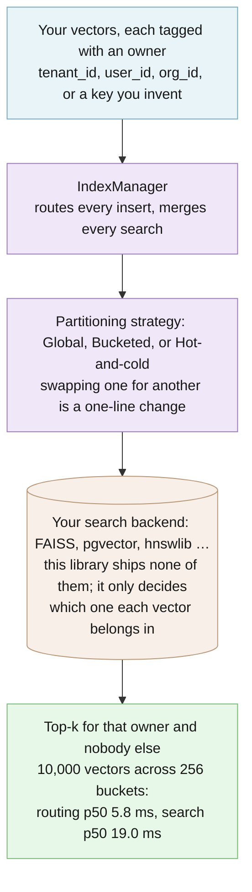

# edgeproc-core architecture

This is the technical companion to the [README](../README.md). It covers how routing and
filtering work, the three partitioning strategies, the backend conformance suite, the error
module, configuration, the security model, and what the tests and benchmark actually prove.

For the full design notes on index sizing and rebuilds, see
[vector-mgmt-architecture.md](vector-mgmt-architecture.md). For the security, privacy,
reliability and performance contract, see [OPERATIONS.md](OPERATIONS.md).

## The two modules

The package holds two independent modules that happen to ship together:

| Module | What it does |
| --- | --- |
| `edgeproc_core.vector_mgmt` | Routes each vector to a physical index by its owner, filters every call by owner, and merges results. |
| `edgeproc_core.errors` | Turns a raw failure into a stable code, readable text, and RFC 9457 Problem Details JSON. |

Neither imports the other. The only runtime dependency is pydantic. There are no network
calls and no telemetry.

## Where it sits among the sibling projects

```
edge-reco        store search and recommendations (browser app + Python backend)
  └─ edge-proc   ships signed data to devices; FAISS search on the device
       └─ edgeproc-core   ← this package: the vector-partitioning protocol + error codes
```

- [edge-proc](https://github.com/hseshadr/edge-proc) (PyPI `edge-proc`) declares
  `edgeproc-core>=0.4.3` and implements this library's `VectorIndex` protocol over FAISS as
  `LocalVecIndex`.
- [edge-reco](https://github.com/hseshadr/edge-reco)'s Python backend depends on `edge-proc`
  and imports `edgeproc_core.vector_mgmt.core.types` directly.
- [@edgeproc/browser](https://github.com/hseshadr/edgeproc-browser) is the TypeScript
  browser-side checker for edge-proc's signed bundles. It does not use this package.
- [@edgeproc/errors](https://github.com/hseshadr/errors) is the TypeScript twin of
  `edgeproc_core.errors`. The 18 starter codes are identical in both, so a failure keeps one
  name across a Python backend and a TypeScript front end.
- [privacy-core](https://github.com/hseshadr/privacy-core) (`@edgeproc/privacy-core` on npm)
  shares only the npm scope. It redacts personal data from AI prompts and has no code
  relationship with this package.

## Routing and filtering

You tag each vector with its owner (`tenant_id`, `user_id`, or a key you invent). `IndexManager`
asks the partitioning strategy which physical index that owner's vectors belong in (one global
index, one of N hash buckets, or a hot or cold tier) and calls your backend there. Every scoped
search, delete and stats call also passes the owner as a filter, so owners that share a physical
index still see only their own rows. Results from several indexes are merged into one top-k list.



[Explore the interactive architecture map](architecture/index.html) (Archify, generated from
[`architecture/runtime.architecture.json`](architecture/runtime.architecture.json)).

The partitioning *protocol* is the set of methods a search backend must provide, written as a
Python `typing.Protocol`, so there is nothing to subclass. Two protocols, `VectorIndex` and
`IndexFactory`, separate the strategy from the backend: swap the strategy without touching the
index, and swap the index without touching the strategy.

### A minimal search

Against the bundled in-memory reference index:

```python
import asyncio
from edgeproc_core import GlobalPartitionStrategy, IndexManager, VectorEmbedding
from edgeproc_core.vector_mgmt.testing import in_memory_factory

async def demo() -> None:
    strategy = GlobalPartitionStrategy(index_factory=in_memory_factory)
    manager = IndexManager(partition_strategy=strategy)
    await manager.insert(
        [VectorEmbedding(entity_id="a", embedding=[0.1, 0.2, 0.3, 0.4], tenant_id="t1")],
        partition_key="t1",
    )
    print(await manager.search([0.1, 0.2, 0.3, 0.4], k=5, partition_key="t1"))

asyncio.run(demo())  # → [('a', ~0.0)]  exact match, cosine distance ≈ 0
```

`InMemoryVectorIndex` is a reference implementation for tests and examples. In production you
implement `VectorIndex` against your own backend. See
[edge-proc's `LocalVecIndex`](https://github.com/hseshadr/edge-proc) for a FAISS-backed one.

## Partitioning strategies

All strategies accept `partition_key_name` (default `"tenant_id"`) and an optional
`partition_key_extractor` callable.

| Strategy | When to use | How it routes |
|----------|-------------|---------------|
| `GlobalPartitionStrategy` | < 50K partition keys | One global index; filter by metadata at query time ([example](../examples/basic_usage.py)) |
| `BucketedPartitionStrategy` | 50K – 5M partition keys | Hash the partition key into one of N buckets, default 256 ([example](../examples/custom_partition_key.py)) |
| `TwoTierPartitionStrategy` | Time-keyed workloads | Split by `metadata["created_at"]` into a hot tier and a cold tier ([example](../examples/two_tier_partition.py)) |

Bucketing means collisions are expected by design: once partition keys outnumber buckets, two
tenants share one physical index. Isolation does not depend on them landing in different
buckets, because a scoped call filters by partition key inside the index.
[`tests/test_tenant_isolation.py`](../tests/test_tenant_isolation.py) proves this by forcing the
worst case (`num_buckets=1`, every key colliding) and asserting a tenant still sees only its own
rows. Partition names are routing hints, never security principals: enforce isolation in your
backing store too.

`search`, `delete` and `get_stats` all mean the same thing by `partition_key`: each one filters,
so a caller cannot destroy or count a row it could not read. Pass no key and there is no filter.
That is the documented administrative, cross-partition path. `rebuild_if_needed` is the one
deliberate exception: a slice of a shared index cannot be compacted on its own, so there
`partition_key` picks which physical index to maintain and nothing more.

The deep dive (rationale, scaling math, recommended `m` / `ef_construction`) lives in
[vector-mgmt-architecture.md](vector-mgmt-architecture.md).

### Generic partition keys

The library was originally `tenant_id`-only. Since v0.1 it supports any partition key:

- store it in `VectorEmbedding.metadata` (for example `{"user_id": "u1"}`),
- pass `partition_key_name="user_id"` to your strategy and manager,
- optionally pass a `partition_key_extractor` for composite keys (see
  [`examples/composite_partition_key.py`](../examples/composite_partition_key.py)).

The legacy `tenant_id` field on `VectorEmbedding` still works.

## Implementing your own backend

If you implement `VectorIndex` yourself, run the conformance suite against it. It tells you
whether your backend is safe to put in front of more than one tenant:

```python
# tests/test_my_backend_conformance.py
from edgeproc_core.vector_mgmt.conformance import assert_vector_index_conformance

from my_project import MyVectorIndex


async def my_factory(name, config=None):
    return MyVectorIndex(name, config)


async def test_my_backend_is_conformant():
    await assert_vector_index_conformance(my_factory)
```

It passes silently and raises `AssertionError` naming every property you break. Not using
pytest? It is a plain coroutine: `asyncio.run(assert_vector_index_conformance(my_factory))`
exits non-zero on failure. If your partition key is not `tenant_id`, say so:
`assert_vector_index_conformance(my_factory, partition_key_name="org_id")`.

**Why you need it.** `delete()` and `get_stats()` take a `filters` argument, and `IndexManager`
passes the partition scope through it. The argument has a default, so a backend that accepts
`filters` and never applies it still type-checks and still passes its own tests, and silently
deletes the neighbouring tenant's rows on every scoped delete. Bucket collisions are expected,
so the index a key routes to routinely holds other keys' rows. No compiler or linter can see that
failure. The suite seeds two partitions into one physical index, gives every row the same vector
so ranking cannot be what separates them, and checks that the filter is actually applied:

| Check | What it catches |
| --- | --- |
| `rows_are_readable_back` | Nothing was stored, so every result below would be vacuous |
| `search_applies_filters` | A scoped read returns someone else's rows |
| `search_ands_multi_key_filters` | Filter keys ORed, so a partition key narrows nothing |
| `empty_filters_search_is_unscoped` | `filters={}` read as a scope, so an admin read sees nothing |
| `scoped_delete_spares_other_partitions` | **Cross-partition data destruction** |
| `scoped_delete_removes_its_own_rows` | A backend "passing" by never deleting |
| `multi_key_delete_ands_its_filters` | **Cross-partition destruction via ORed filter keys** |
| `unscoped_delete_is_administrative` | An unscoped delete silently doing nothing |
| `empty_filters_delete_is_administrative` | `filters={}` silently deleting nothing and reporting success |
| `unscoped_stats_report_the_physical_total` | Stats that never saw the rows |
| `empty_filters_stats_report_the_physical_total` | `filters={}` counted as an empty scope |
| `scoped_stats_count_only_their_partition` | A row count leaked across partitions |
| `multi_key_stats_count_the_intersection` | A count inflated by a neighbour's rows |

Two rules the checks depend on. Filter keys are ANDed: a row must match every one of them.
`IndexManager` merges the partition scope *into* your filters, so a backend that ORs them lets
the partition key stop narrowing anything: a tenant-scoped search carrying any filter of its own
returns every other tenant's matching rows, and the matching delete destroys them. And an empty
filter mapping is no scope at all, identical to passing none. The manager composes `{}` (never
`None`) for every unscoped call, so that is the only shape an administrative delete ever reaches
your backend in.

What the suite does not grade: recall, latency, `rebuild()`, and how you attribute tombstones to
a scope. Those are backend-specific and untested here.

## Canonical errors

`edgeproc_core.errors` has nothing to do with vector search. It solves a different recurring
problem, and it is roughly as much code as the partitioning layer.

**The problem.** The same failure arrives in a dozen shapes. An HTTP 402, a thrown
`TimeoutError`, a browser's "Failed to fetch": each is a different object, so every layer of an
app re-writes the same brittle `if` ladder to decide what to show the user, and the answers drift
apart.

**What it does.** You register a *catalog* (a set of stable, namespaced codes like
`net.unreachable`) and then always speak in codes:

- `classify(raw)` turns any raw failure into a stable code
- `describe(code)` renders human text, through your own i18n if you have one
- `to_problem_details(code).to_dict()` produces the [RFC 9457](https://www.rfc-editor.org/rfc/rfc9457)
  Problem Details JSON an API returns. Params become public extension members, so never pass
  secrets. Only params with a plain `str` key and a `str`, `int`, or finite `float` value reach
  the body; params named `type`, `title`, `status`, `detail`, `instance`, `__proto__`,
  `constructor`, `prototype`, or `toJSON` are reserved and dropped

```python
from edgeproc_core.errors import define_errors, starter_pack

registry = define_errors(starter_pack)          # 18 universal codes, or bring your own
registry.classify({"status": 402})              # → 'ai.provider.out_of_credits'
registry.describe("net.unreachable")            # → "Couldn't reach the server. …"
registry.to_problem_details("net.unreachable").to_dict()
```

`starter_pack` covers the common provider / config / network / timeout / device / integrity /
internal cases so you need not re-declare them; `define_errors` rejects a duplicate code at
registration. The codes match the TypeScript `@edgeproc/errors` package.

Runnable demo: [`examples/canonical_errors.py`](../examples/canonical_errors.py).

## Configuration

There are no environment variables or config files. Every setting is a constructor argument:

| Setting | Where | Default | What it changes |
| --- | --- | --- | --- |
| `partition_key_name` | every strategy, `IndexManager` | `"tenant_id"` | which metadata key names the owner |
| `partition_key_extractor` | every strategy | `None` | a callable for composite keys |
| `num_buckets` | `BucketedPartitionStrategy` | `256` | how many physical indexes owners are hashed into |
| `hot_retention_days` | `TwoTierPartitionStrategy` | `30` | how old (by `metadata["created_at"]`) a vector gets before it moves to the cold tier |
| `index_factory` | every strategy | none (required) | builds your backend's index for a partition name |
| `m`, `ef_construction`, `ef_search`, `dimension`, `distance_metric` | `IndexConfig` | `32`, `200`, `100`, `1536`, `"cosine"` | passed through to your backend; this library builds no HNSW graph |
| rebuild thresholds | `IndexManager.rebuild_if_needed` | tombstones > 10% or size > 1000 MB | when a physical index is rebuilt |

## Source tree

```
edgeproc_core/
  vector_mgmt/
    core/
      types.py          # VectorEmbedding, IndexConfig, IndexStats, VectorIndex, IndexFactory
      index_manager.py  # IndexManager: routes inserts, merges top-k searches
    partitioning/
      strategies.py     # GlobalPartitionStrategy, BucketedPartitionStrategy, TwoTierPartitionStrategy
    testing.py          # InMemoryVectorIndex: reference impl for tests + examples
    conformance.py      # assert_vector_index_conformance: grade your own backend
  errors/               # canonical error codes
    types.py            # Category, CatalogEntry, ProblemDetails (RFC 9457)
    registry.py         # Registry + define_errors: classify / describe / serialize
    starter_pack.py     # 18 universal codes, ready to reuse
    raw.py              # duck-typing helpers for failures of unknown shape
    canonical_error.py  # CanonicalError, DuplicateCodeError
examples/               # basic / custom-key / composite-key / two-tier / errors, plus run_loop.sh
tests/                  # pytest suite (≥90% branch coverage enforced)
```

## Design notes

- **Why it exists.** Every multi-tenant vector-search system rediscovers the same partitioning
  patterns ("global + filter", "hash buckets", "hot/cold"). This library does that once, typed,
  so downstream projects (`edge-proc` and others) can `import edgeproc_core` instead of
  reinventing it. A clean partitioning protocol is also what lets edge-proc ship a vector index
  as a content-addressed file that a device downloads and searches locally.
- **Quality bar.** `mypy --strict` clean, xenon grade A complexity, ≥90% branch coverage.
  Backwards-compatible with the legacy `tenant_id` API.

## When to pick this over the alternatives

| Alternative | It is the better choice when | This library is the better choice when |
| --- | --- | --- |
| One index per customer | you have a few large customers and can afford an index each | you have thousands to millions of owners, where per-owner indexes waste memory and startup time |
| Your vector store's own namespaces or multi-tenancy | you are committed to that one store | you want the partitioning scheme to stay portable across FAISS, pgvector, hnswlib and tests |
| A hand-rolled "global index + metadata filter" | you only ever need that one scheme | you want to move to buckets or hot/cold tiers without rewriting callers, and a conformance suite that proves the filter is applied |
| Per-layer error `if` ladders | the app is tiny | the same failure must mean the same thing in the API, the UI and the logs (and in TypeScript, via `@edgeproc/errors`) |

## Security and trust model

- **Checked:** a scoped call is filtered by partition key inside the index, even when owners
  collide in one physical index. [`tests/test_tenant_isolation.py`](../tests/test_tenant_isolation.py)
  forces `num_buckets=1` and checks it, and `assert_vector_index_conformance` checks the same
  property for *your* backend. Releases are built by Dagger from an exact `main` commit and
  published to PyPI by trusted publishing (OIDC) with attestations, from a job that first checks
  the candidate's lineage.
- **Refuses rather than warns:** the conformance suite raises `AssertionError` naming every
  property your backend breaks; `define_errors` raises on a duplicate code; Problem Details drop
  reserved members (`type`, `title`, `status`, `detail`, `instance`, `__proto__`, `constructor`,
  `prototype`, `toJSON`) and any value that is not a plain string or finite number; the PyPI
  publisher refuses a candidate that is not a successful dispatch of `release-candidate.yml` for a
  commit on `main`.
- **Not protected:** an *unscoped* call (no partition key) is a deliberate cross-partition
  administrative read or delete; partition names are routing hints, never security principals; a
  backend that ignores `filters` leaks across owners (run the conformance suite);
  `InMemoryVectorIndex` is not a production store; Problem Details members are public, so never
  pass secrets as params.
- **Verify a release:** the wheel and sdist on PyPI carry PEP 740 attestations. Check one with
  `pypi-attestations verify pypi --repository https://github.com/hseshadr/edgeproc-core pypi:edgeproc_core-0.4.3-py3-none-any.whl`,
  or read `https://pypi.org/integrity/edgeproc-core/0.4.3/edgeproc_core-0.4.3-py3-none-any.whl/provenance`.

To report a vulnerability, see [SECURITY.md](../SECURITY.md).

## What the tests prove

The hosted CI run and the full local check (`uv run poe gate`) pass at
**99.31% coverage measured with branches enabled**, with strict mypy, lint, and formatting.
The check runs `--cov-branch` and enforces a ≥90% branch coverage floor. Split into its two
parts: 99.13% of statements and 100.00% of branches are covered. A step in `poe gate`
([`scripts/check_coverage_claim.py`](../scripts/check_coverage_claim.py)) re-derives all three
figures from `coverage.xml`, so this paragraph cannot quietly drift.

The bundled benchmark (`benchmarks/benchmark.py`) reports **routing p50 5.8 ms / p95 6.0 ms**
for 10,000 embeddings across 256 buckets, and **reference search p50 19.0 ms / p95 19.2 ms**
against the bundled in-memory index (see [A minimal search](#a-minimal-search) for what that
reference index is and isn't).

Measured 2026-07-20 on an Apple M3 Pro (macOS 26.5, arm64, CPython 3.13.5), 20 samples per run,
machine otherwise idle. Across six consecutive runs routing p50 spanned 5.7–6.1 ms and search p95
spanned 18.7–20.2 ms; a busy machine measures higher. These describe that tree on that laptop,
not a promise for your hardware. Reproduce with:

```bash
uv run python benchmarks/benchmark.py
```

[`tests/test_benchmark_claims.py`](../tests/test_benchmark_claims.py) keeps these figures equal
to the ones in [OPERATIONS.md](OPERATIONS.md) and within 3x of the recorded measurement.

It does **not** prove the recall or latency of any real backend (the numbers above come from the
bundled in-memory reference index), that your backend isolates owners (run the conformance suite
against it), or anything about `rebuild()` or tombstone attribution in your store.

## Shipped and planned

**Shipped (v0.4.3):** the three partitioning strategies, generic and composite partition keys,
`IndexManager`, the in-memory reference index, the backend conformance suite, and the canonical
error catalog with RFC 9457 Problem Details.

**Planned (not shipped):** some sections of [vector-mgmt-architecture.md](vector-mgmt-architecture.md)
describe planned features (for example atomic-swap reindexing and query-optimization patterns);
they are design notes, not shipped code. No production backend ships in this package.
